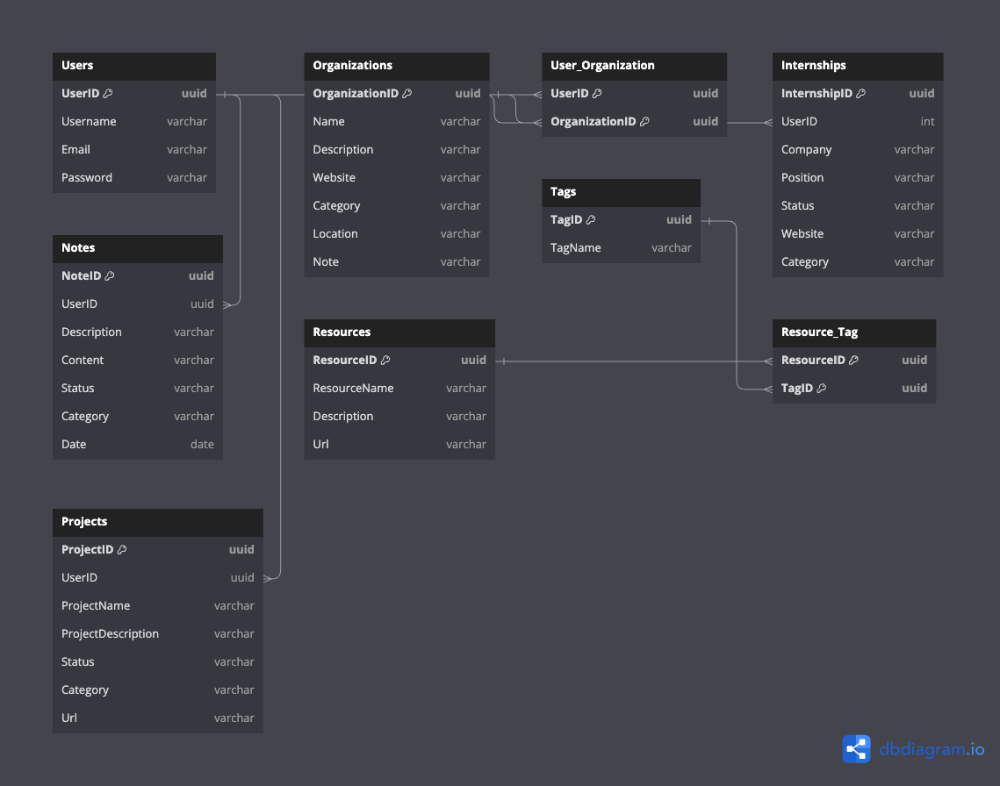

# Entity Relationship Diagram

Reference the Creating an Entity Relationship Diagram final project guide in the course portal for more information about how to complete this deliverable.

## Create the List of Tables

- Users
- Organizations
- Internships
- Projects
- Resources
- Notes
- Tags

## Add the Entity Relationship Diagram

